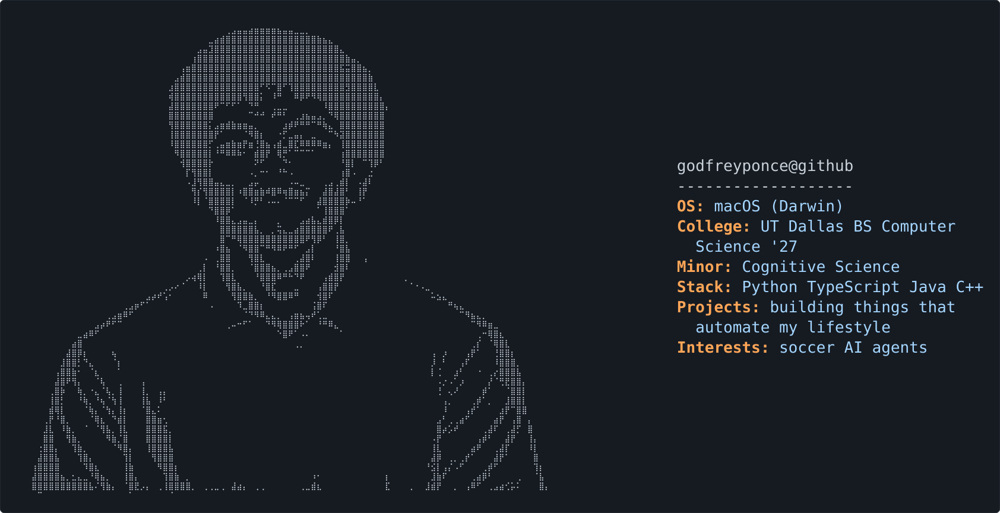

<picture>
  <source media="(prefers-color-scheme: dark)" srcset="dark_mode.svg">
  <source media="(prefers-color-scheme: light)" srcset="light_mode.svg">
  
</picture>

Junior CS student in Dallas. Most of these started as a problem I had that week.

[Here's my site](https://godfreyponce.dev)

## Current projects

### Things I actually use every day

- **[kal](https://github.com/godfreyponce/kal)**: Started tracking my calories, so I built a tracker
- **[Debrief](https://github.com/godfreyponce/Debrief)**: My morning paper. Makes it easier for me to keep up with AI and tech
- **[glass](https://github.com/godfreyponce/glass)**: A simplified way to check on everything I'm building

### Work stuff

- **[Jira-Alerts](https://github.com/godfreyponce/Jira-Alerts)**: Jira emails are horrible, so my tickets DM me on Teams instead
- **[jiraPlane](https://github.com/godfreyponce/jiraPlane)**: Basically Jira-Alerts with an upgraded visual. A paper airplane flies across my screen when Jira needs me

### Everything else

- **[clawd](https://github.com/godfreyponce/clawd)**: A crab on my desk that tells me how my running agents are doing
- **[terrariaCompanion](https://github.com/godfreyponce/terrariaCompanion)**: Played Terraria for the first time this year, idk where to start, so I built this
- **[LocalPro-Realty](https://github.com/godfreyponce/LocalPro-Realty)**: Internship take home project that I got ghosted on
